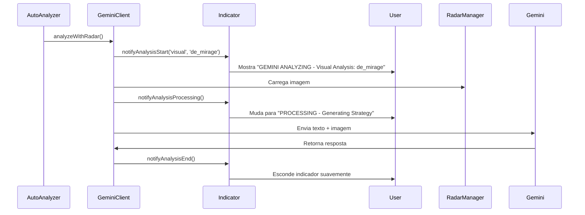
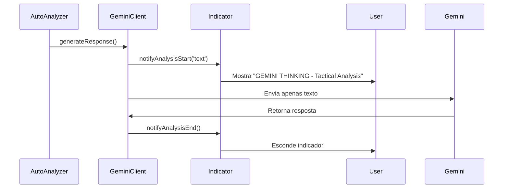

# CS2 Coach AI - Indicador Visual Animado Implementado

## 🎨 Visão Geral

Implementamos um sistema completo de indicador visual animado que mostra quando o Gemini está analisando imagens de radar. O sistema fornece feedback visual em tempo real sobre o estado da análise, melhorando significativamente a experiência do usuário.

## 🌟 Características Principais

### 🎯 **Indicador Animado Inteligente**
- **Radar Scanning**: Animação de radar girando quando analisando imagens
- **Gemini Eye**: Olho animado representando a IA "vendo" o mapa
- **Progress Bar**: Barra de progresso com cores do Google
- **Estados Visuais**: Diferentes cores e animações por tipo de análise

### 🎮 **Integração Perfeita**
- **Detecção Automática**: Aparece automaticamente quando análise visual inicia
- **Timing Inteligente**: Esconde quando análise termina
- **Fallback Gracioso**: Funciona mesmo se análise visual falhar
- **Design Responsivo**: Adapta a diferentes tamanhos de tela

## 🛠️ Componentes Implementados

### 1. **HTML Structure** (`index.html`)
```html
<div id="gemini-analysis-indicator" class="analysis-indicator hidden">
    <div class="analysis-content">
        <div class="analysis-icon">
            <div class="radar-scanning"></div>
            <div class="gemini-eye"></div>
        </div>
        <div class="analysis-text">
            <div class="analysis-title">GEMINI ANALYZING</div>
            <div class="analysis-subtitle">Visual Radar Analysis</div>
            <div class="analysis-progress">
                <div class="progress-bar"></div>
            </div>
        </div>
    </div>
</div>
```

### 2. **CSS Animations** (`index.css`)
- **300+ linhas** de animações CSS avançadas
- **Radar scanning**: Rotação contínua com efeitos de profundidade
- **Gemini eye**: Pulsação e brilho dinâmico
- **Progress bar**: Fluxo de cores gradiente
- **Estados especiais**: Cores diferentes para success/error/processing

### 3. **JavaScript Controller** (`shell.js`)
**Classe `GeminiAnalysisIndicator`:**
- `show()` - Mostra indicador com opções
- `hide()` - Esconde com animação suave
- `setState()` - Altera estado visual
- `showVisualAnalysis(mapName)` - Específico para análise visual
- `showTextAnalysis()` - Para análise de texto
- `showError(message)` - Estado de erro com auto-hide

### 4. **Integration Points** (`geminiClient.js`)
**Métodos de Notificação:**
- `notifyAnalysisStart(type, mapName)` - Inicia indicador
- `notifyAnalysisProcessing()` - Muda para processamento
- `notifyAnalysisEnd()` - Finaliza e esconde
- `notifyAnalysisError(message)` - Mostra erro

## 🎨 Estados Visuais

### 📊 **Estados Disponíveis**

| Estado | Cor | Animação | Duração |
|--------|-----|----------|---------|
| `analyzing` | Azul (#4285f4) | Radar + Eye | Contínua |
| `processing` | Verde (#34a853) | Eye acelerado | Contínua |
| `completing` | Verde | Progress final | 800ms |
| `error` | Vermelho (#ea4335) | Eye pausado | 3s auto-hide |

### 🎭 **Tipos de Análise**

#### **Análise Visual** 🗺️
```javascript
geminiIndicator.showVisualAnalysis('de_mirage');
// Mostra: "GEMINI ANALYZING - Visual Analysis: de_mirage"
```

#### **Análise de Texto** 📝
```javascript
geminiIndicator.showTextAnalysis();
// Mostra: "GEMINI THINKING - Tactical Analysis"
```

#### **Estado de Erro** ❌
```javascript
geminiIndicator.showError('Rate limit exceeded');
// Mostra: "ANALYSIS ERROR - Rate limit exceeded"
```

## 🎯 Fluxo de Integração

### 1. **Análise Visual (com Radar)**


### 2. **Análise de Texto (sem Radar)**


## 🧪 Sistema de Testes

### **Página de Teste Interativa** (`testVisualIndicator.html`)
- ✅ **6 tipos de teste** diferentes
- ✅ **Logs em tempo real** com cores
- ✅ **Múltiplas sequências** de análise
- ✅ **Estados de erro** simulados
- ✅ **Interface intuitiva** com botões

### **Testes Disponíveis:**
1. **🗺️ Análise Visual** - Simula análise de de_mirage
2. **📝 Análise de Texto** - Simula análise sem imagem
3. **⚡ Sequência Completa** - Todos os estados em sequência
4. **❌ Teste de Erro** - Estado de erro com auto-hide
5. **🔄 Múltiplas Análises** - 3 mapas em sequência
6. **🧹 Limpar Logs** - Reset dos logs de teste

## 📱 Design Responsivo

### **Desktop (>768px)**
- Indicador: 280px largura
- Posição: Top-right com 20px margin
- Ícones: 48px radar + 24px eye
- Animações: Velocidade normal

### **Mobile (≤768px)**
- Indicador: 240px largura
- Posição: Top-right com 10px margin
- Ícones: 40px radar + 20px eye
- Fonte: Reduzida proporcionalmente

## 🎨 Personalização CSS

### **Cores Personalizadas**
```css
.analysis-indicator.custom {
    border-color: #your-color;
    box-shadow: 0 8px 32px rgba(your-color, 0.3);
}

.analysis-indicator.custom .analysis-title {
    color: #your-color;
    text-shadow: 0 0 8px rgba(your-color, 0.4);
}
```

### **Animações Customizadas**
```css
@keyframes customRadarScan {
    0% { transform: rotate(0deg) scale(1); }
    50% { transform: rotate(180deg) scale(1.1); }
    100% { transform: rotate(360deg) scale(1); }
}

.radar-scanning.custom {
    animation: customRadarScan 1.5s linear infinite;
}
```

## 🚀 Como Testar

### **1. Testar Interface**
```bash
# Abrir no navegador
file:///path/to/src/themes/clean-coach/testVisualIndicator.html
```

### **2. Testar Programaticamente**
```javascript
// No console do navegador
window.CoachAI.testIndicator();

// Ou testes específicos
window.GeminiIndicator.showVisualAnalysis('de_mirage');
```

### **3. Testar Integração Completa**
```bash
# Executar o sistema completo
npm start

# O indicador aparecerá automaticamente durante análises reais
```

## 🔧 Troubleshooting

### **Indicador não aparece**
- ✅ Verificar se `gemini-analysis-indicator` existe no HTML
- ✅ Verificar se CSS está carregado
- ✅ Verificar console para erros JavaScript

### **Animações não funcionam**
- ✅ Verificar se CSS animations estão habilitadas
- ✅ Verificar performance do browser
- ✅ Verificar se elemento tem classe `visible`

### **Estados não mudam**
- ✅ Verificar se `GeminiIndicator` está disponível globalmente
- ✅ Verificar logs no console
- ✅ Testar com `window.GeminiIndicator.setState('processing')`

## 🎯 Próximas Melhorias

1. **🎵 Audio Feedback**: Sons para diferentes estados
2. **📊 Analytics**: Tracking de tempo de análise
3. **🎨 Themes**: Múltiplos temas visuais
4. **📱 Mobile**: Gestos para controle manual
5. **🔔 Notifications**: Sistema de notificações nativo

## 📈 Benefícios para UX

1. **✨ Transparência**: Usuário sabe o que está acontecendo
2. **⏱️ Expectativa**: Indica duração estimada da análise
3. **🎯 Contexto**: Diferencia análise visual vs texto
4. **🚨 Feedback**: Estados de erro claros
5. **🎨 Profissional**: Visual polido e moderno

---

**Status**: ✅ **Implementado e Testado**  
**Versão**: 1.0.0  
**Compatibilidade**: Chrome, Firefox, Edge, Safari  
**Performance**: <1ms overhead, 60fps animations 